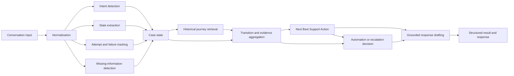

# SpotifyCares Support Agent Architecture

## Scope and design objective

This document defines a future architecture for a SpotifyCares support agent using the historical Customer Support on Twitter dataset. It is an architecture specification only. It does not build the agent, modify the raw dataset, create embeddings, install packages, create a vector database, or call an LLM.

The central design object is a reconstructed support journey:

```text
historical support journeys
        -> observed state transitions and action outcomes
current conversation
        -> current state, missing information, attempted actions, risk
retrieval and transition evidence
        -> Next Best Support Action
response drafting and escalation decision
```

The system should recommend a defensible next support action, not merely generate a semantically similar reply. The existing taxonomy remains the contract:

- 10 customer intents
- 9 troubleshooting journey states
- 13 support actions

Missing diagnostic information is represented as a condition or requirement attached to the current case, not as a tenth state. `RESOLVED` and `MONITORING` remain distinct.

## 1. Architecture overview

The architecture is a staged pipeline with a structured case state as its shared interface. Each stage produces typed, provenance-aware fields rather than an unstructured prompt for a single model.



### Architectural principles

1. The conversation state is explicit and inspectable.
2. A retrieved journey is evidence, not an instruction that must be copied.
3. Historical transitions are used to rank actions, not to assert that old policies remain current.
4. Failed attempts are durable case context and are negative evidence against repeating the same action.
5. Model confidence, historical evidence strength, and operational risk are separate values.
6. Escalation is a first-class outcome, not a fallback hidden inside response generation.
7. Every recommended action and drafted response should be traceable to structured inputs and cited historical evidence.

## 2. End-to-end data flow

1. Receive the current customer message and, when available, the prior conversation in chronological order.
2. Normalize message roles, timestamps, language metadata, links, quoted text, and conversation boundaries without changing customer meaning.
3. Extract the current 10-intent label or ranked intent candidates.
4. Extract the current troubleshooting state from the 9-state vocabulary.
5. Track actions already attempted, their observed results, and whether the customer explicitly reported failure, improvement, recurrence, or resolution.
6. Detect missing diagnostic information as requirements, including which existing support action could request each requirement.
7. Calculate risk indicators and determine whether private, high-risk, conflicting, or specialist handling is implicated.
8. Retrieve similar reconstructed SpotifyCares journeys and relevant state-to-action transitions, excluding the current conversation and any leakage-prone records.
9. Aggregate transition evidence for the eligible existing 13 support actions.
10. Select a Next Best Support Action, or select escalation when evidence, risk, or state makes automation inappropriate.
11. Decide whether the case may be auto-handled or must be escalated, independently of model confidence.
12. Draft a response constrained by the selected action, current state, evidence, known limitations, and escalation decision.
13. Emit the response together with structured state, action, evidence, confidence, risk, and escalation reason for evaluation and audit.

The customer-visible response is the final presentation layer. It is not the decision layer.

## 3. Component responsibilities

| Component | Input | Output | Responsibility | Proposed approach | Why appropriate |
|---|---|---|---|---|---|
| Conversation normalization | Raw messages and available thread metadata | Canonical conversation with roles, order, IDs, timestamps, cleaned text, link/privacy flags | Establish a stable representation and preserve source references | Deterministic parsing and normalization, with rule-based metadata extraction | Thread structure and provenance should be reproducible; normalization should not depend on generative interpretation |
| Intent detection | Current conversation and normalized customer text | Ranked intent candidates, selected intent, confidence, supporting spans | Assign one of the frozen 10 customer intents | Start with a transparent traditional ML or rule-plus-ML classifier; retain ranked alternatives | The labels are bounded and evaluable; explainability and a baseline are important before LLM use |
| Troubleshooting state extraction | Conversation, selected intent, prior extracted state | Current one-of-9 state, confidence, state evidence, transition candidates | Identify where the case is in the journey | Structured classifier with deterministic precedence rules for explicit outcomes and specialist/private states | State depends on accumulated conversation context, not only the newest wording |
| Attempt and failure tracking | Conversation and support messages | Ordered attempted actions, result per attempt, failure/relapse flags, evidence spans | Preserve what was tried and whether it worked | Hybrid extraction: action lexicon and sequence rules, with a later supervised or LLM-assisted interpretation option | The 13 actions are controlled; explicit failure markers are high-value deterministic signals |
| Missing-information detection | Intent, state, conversation facts, taxonomy requirements | Missing-information items, satisfied items, uncertainty, candidate asking actions | Identify the smallest diagnostic requirement that blocks a safe next step | Rule-based requirement matrix plus structured extraction; optional ML for ambiguous facts | Required fields are domain-specific and should be inspectable; this is distinct from state classification |
| Historical journey retrieval | Case state, normalized conversation, retrieval filters | Ranked journey IDs, transition snippets, similarity metadata, provenance | Find comparable reconstructed conversations and local transition examples | Hybrid lexical/structured retrieval first; embeddings may be evaluated later but are not part of this phase | The retrieval unit should preserve sequence, attempts, and outcomes rather than isolate tweets |
| Transition and evidence aggregation | Case state, eligible actions, retrieved journeys | Per-action support counts, transition outcomes, conflicts, coverage, evidence strength | Estimate which actions historically followed comparable situations | Deterministic aggregation over annotated or extracted transitions | Separates evidence calculation from generation and makes decisions auditable |
| Next Best Support Action engine | Intent, state, missing information, attempt history, retrieved evidence, risk | One selected action from the 13, alternatives, rationale, action confidence | Select the next action and prevent failed repetition | Constrained ranking or policy layer with hard exclusions and transparent scoring | This is the central decision layer and must encode safety and state-aware behavior |
| Evidence and confidence calculation | Component outputs and retrieved records | Model confidence, evidence strength, risk, coverage, conflict indicators | Keep uncertainty dimensions separate and traceable | Deterministic calculations over calibrated component scores and source counts | A single confidence number would hide weak evidence and operational risk |
| Automation/escalation decision | Selected action, state, evidence, risk, confidence, policy thresholds | `AUTO_HANDLE` or `ESCALATE`, reason codes, required handoff context | Decide whether a human must review | Explicit policy gate with hard escalation rules and configurable thresholds | High-risk cases must not become automatic merely because an LLM is confident |
| Response drafting | Structured case state, selected action, evidence citations, constraints, escalation result | Draft customer response plus claims and source references | Express the selected action without inventing policy or evidence | Constrained LLM or template-based drafting, followed by validation | Generation should improve language quality while decisions remain structured and grounded |

No component may silently add an intent, state, or support action outside the frozen taxonomy.

## 4. Data contracts between components

The contracts below are conceptual schemas for later implementation. They specify fields and semantics, not code or storage technology.

### 4.1 Canonical conversation

```text
CanonicalConversation
- conversation_id: stable source or reconstructed journey identifier
- messages: ordered list of Message
- source_dataset: dataset name and source reference
- reconstruction_status: complete, partial, or uncertain
- customer_message_ids: list of source IDs
- support_message_ids: list of source IDs
- normalization_warnings: list of warnings
```

```text
Message
- message_id: source tweet ID when available
- role: customer or support
- timestamp: source timestamp when available
- text: normalized text with original text reference retained
- links: extracted links and link types
- privacy_flags: possible account, payment, or security data
- source_reference: dataset row or immutable source locator
```

Normalization must preserve source IDs and original ordering so all later claims can be traced back.

### 4.2 Structured case state

```text
CaseState
- conversation_id
- intent: one frozen intent plus ranked alternatives
- troubleshooting_state: one frozen journey state
- missing_information: list of MissingInformationItem
- attempted_actions: list of AttemptedAction
- latest_customer_feedback: result, failure, improvement, relapse, resolution, or unknown
- context_facts: device, OS, app/browser version, network, country, URI, scope, and other extracted facts
- risk_flags: list of RiskFlag
- state_confidence: score plus evidence spans
- last_updated_message_id
```

```text
MissingInformationItem
- requirement: controlled requirement name
- why_needed: branch or decision it supports
- status: missing, present, conflicting, private, or unknown
- candidate_support_actions: existing action names only
- evidence_spans: source references
```

```text
AttemptedAction
- action: one of the frozen 13 support actions
- message_id or source reference
- status: attempted, failed, partially_helped, improved, resolved, or unknown
- explicitness: explicit, inferred, or ambiguous
- failure_evidence: source spans when present
- sequence_index
```

An action marked `failed` or a clearly repeated action with negative feedback is ineligible for direct repetition unless new evidence explains why the prior attempt was not equivalent.

### 4.3 Retrieved journey and transition evidence

```text
RetrievedJourney
- journey_id: reconstructed source identifier
- rank and retrieval_score
- similarity_dimensions: intent, state, missing information, symptoms, environment
- messages_or_snippets: source-referenced excerpts
- observed_actions: ordered support actions
- observed_state_transitions: ordered state pairs
- observed_customer_results: result labels and evidence spans
- outcome_visibility: visible, partial, DM-ended, or unknown
- split_membership: train, validation, test, or golden-isolated
```

```text
TransitionEvidence
- target_action: one of the frozen 13 actions
- supporting_journey_ids
- relevant_example_count
- eligible_transition_count
- progression_count: examples showing a favorable next-state movement
- failure_or_conflict_count
- outcome_visibility_count
- evidence_strength: strong, moderate, weak, conflicting, or insufficient
- coverage: how much of the current case is supported
- provenance: source references for every aggregate
```

The system should distinguish an observed support action from a proven successful resolution. A journey ending after a DM request cannot be counted as evidence that the customer ultimately resolved the issue.

### 4.4 Decision and response result

```text
DecisionResult
- selected_action: one existing action or explicit escalation outcome
- alternative_actions: ranked eligible actions
- action_rationale: structured factors, not free-form unsupported claims
- model_confidence
- historical_evidence_strength
- operational_risk
- automation_decision: AUTO_HANDLE or ESCALATE
- escalation_reason_codes
- evidence_references
```

```text
DraftResponse
- text
- selected_action
- allowed_claims
- unsupported_claims_detected
- evidence_references
- escalation_language_required
- validation_status
```

## 5. Next Best Support Action design

The Next Best Support Action engine is the central decision layer. Its input is the complete `CaseState` plus retrieved `TransitionEvidence`; it must not decide from the latest customer message alone.

### Decision factors

The engine reasons over:

- intent and ranked alternatives;
- current journey state;
- missing information and whether it is conflicting or private;
- attempted actions, order, and observed failures;
- retrieved journeys and their comparable transitions;
- evidence strength, coverage, and conflicting examples;
- operational risk and escalation flags;
- historical outcome visibility.

### Candidate generation

Candidate actions are drawn only from the 13 actions in the taxonomy:

`ASK_PLATFORM_CONTEXT`, `ASK_SYMPTOM_EVIDENCE`, `ASK_SCOPE_OR_ENVIRONMENT`, `ASK_CATALOG_CONTEXT`, `SESSION_RESET`, `REINSTALL_OR_CLEAN_INSTALL`, `BROWSER_REMEDIATION`, `NETWORK_REMEDIATION`, `PROVIDE_HELP_RESOURCE`, `REQUEST_SECURE_ACCOUNT_DETAILS`, `MOVE_TO_DM_OR_SECURE_CHANNEL`, `ESCALATE_TECHNICAL_OR_PRODUCT_ISSUE`, `CONFIRM_AND_MONITOR`.

The candidate set is filtered before ranking:

- remove actions that ask for information already present and reliable;
- remove actions already attempted unsuccessfully when the current evidence is equivalent;
- do not propose public account, payment, or security handling;
- do not propose a first-line repair after repeated failure or a broader incident without new discriminating evidence;
- prefer secure-channel or specialist actions where the current state requires them;
- allow `CONFIRM_AND_MONITOR` only when the customer reports improvement or the support workflow explicitly calls for monitoring;
- permit escalation even when an action candidate has high model confidence.

### Ranking concept

A later implementation can score each candidate using a transparent combination of:

```text
action_score =
    transition_support
  + state_fit
  + missing_information_fit
  + intent_fit
  + progression_signal
  - repeated_failure_penalty
  - conflict_penalty
  - risk_penalty
```

The terms should remain separately inspectable. A high score cannot override a hard escalation rule. The engine should return the selected action, rejected-action reasons, and the evidence used.

### Repeated-failure protection

The engine must maintain an action ledger, not just a list of prior messages. For example, `SESSION_RESET` covers a meaningful logout/restart/login attempt, while `REINSTALL_OR_CLEAN_INSTALL` is a distinct action. If the customer says “still no luck,” “nothing changed,” or equivalent language after an action, that action receives a negative outcome. The engine should change the branch, request a discriminating fact, move to secure handling, or escalate rather than repeat the same step.

A repeat may be allowed only when:

- the earlier attempt was ambiguous or incomplete;
- the environment has materially changed;
- new evidence supports a non-equivalent action instance;
- the response explicitly acknowledges the prior attempt and explains the difference.

## 6. Evidence model

Evidence is a structured record of how historical journeys support or fail to support a proposed action. It is not a generated justification added after the decision.

### Evidence dimensions

1. **Relevance:** similarity in intent, state, missing requirement, environment, symptom, and prior attempts.
2. **Transition support:** how often the target action followed a comparable state and context.
3. **Progression:** whether the next observed state improved, narrowed the issue, moved to secure handling, or escalated.
4. **Outcome visibility:** whether a later result is visible; DM-ended and truncated journeys are not treated as confirmed resolutions.
5. **Coverage:** how many important current-case facts are represented in the supporting examples.
6. **Consistency:** whether comparable journeys recommend the same action or show conflicting branches.
7. **Recency and policy safety:** historical relevance is useful, but old links, product behavior, policies, and catalog state are not current truth by default.

### Evidence strength

- **Strong:** several relevant, non-leaking journeys show the same state-to-action transition, with consistent context and visible progression.
- **Moderate:** multiple relevant transitions exist, but outcome visibility or contextual coverage is incomplete.
- **Weak:** few examples, loose similarity, or mostly generic support language.
- **Conflicting:** comparable journeys take materially different actions without an understood branch condition.
- **Insufficient:** no reliable comparable transition or the case contains unresolved contradictions.

Every evidence summary should expose at least:

- supporting journey IDs or stable references;
- the number of relevant examples;
- the number showing the selected transition;
- the number showing favorable progression, if observable;
- failure, conflict, and incomplete-outcome counts;
- the limitations of the evidence.

The system must say that resolution evidence is unavailable when it is unavailable. A support reply such as “DM us your details” demonstrates a handoff action, not a successful final resolution.

## 7. Automation and escalation policy

Automation is allowed only when all required gates pass. Model confidence is one input, not the policy.

### Separate decision dimensions

- **Model confidence:** confidence that the intent, state, facts, or action prediction is correct.
- **Historical evidence strength:** quality, quantity, relevance, consistency, and outcome visibility of supporting journeys.
- **Operational risk:** privacy, payment, security, account access, specialist investigation, policy uncertainty, and harm from an incorrect action.

These values should be emitted separately and retained in the decision record.

### Escalation eligibility

The case should be eligible for escalation, and generally should not be auto-handled, when any of the following applies:

- account compromise, password/email ownership, payment, refund, Premium entitlement, Family-plan eligibility, or other private account lookup;
- the current state is `PRIVATE_ACCOUNT_CONTEXT_REQUIRED` or `SPECIALIST_OR_PRODUCT_INVESTIGATION`;
- repeated failure, relapse, or a broader cross-device/network incident is present;
- evidence is insufficient or materially conflicting;
- required facts are missing but cannot safely be requested in the current channel;
- the issue involves current catalog, rights, policy, product, or backend truth that historical data cannot establish;
- the response would require a promise of remediation or a claim of resolution;
- the model detects sensitive or high-risk content.

Escalation output should include a concise reason code, attempted-action summary, known facts, missing facts, evidence references, and the recommended human handoff channel. It should not expose private details in a public response.

### Automatic handling boundary

A case may be auto-handled only when the selected action is low risk, the required facts are sufficiently reliable, the action is supported by adequate non-conflicting evidence, no failed equivalent action is being repeated, and the response can be grounded without asserting outdated policy or guaranteed resolution.

## 8. Retrieval strategy

### Retrieval unit

The preferred retrieval unit is a reconstructed SpotifyCares support journey, not an isolated tweet. A journey record should contain chronological customer and support messages, state transitions, attempted actions, customer feedback, handoffs, and outcome visibility.

Isolated messages may be used as a supplemental lexical index, but they should not be the primary evidence unit for a stateful action decision.

### Retrieval stages

1. **Hard filters:** SpotifyCares source, language/quality constraints when defined, split membership, and exclusion of the current conversation.
2. **Structured narrowing:** intent, current state, missing-information requirements, attempted actions, failure status, and risk boundary.
3. **Lexical retrieval:** symptom terms, error wording, platform, artist/catalog context, and action/result phrases.
4. **Optional semantic retrieval later:** evaluate embeddings only after leakage-safe data splits and a non-embedding baseline exist. Embeddings are explicitly out of scope for this architecture phase.
5. **Transition reranking:** prioritize journeys containing a comparable state-to-action transition and a relevant customer result.
6. **Diversity control:** avoid returning many near-identical journeys from one narrow wording pattern or incident.

Retrieval should return the reasons for similarity, not only a numeric score. A retrieved journey with a matching symptom but a different state or prior failure should be down-ranked.

## 9. Role of the LLM

An LLM is optional and subordinate to the structured decision layer.

### Appropriate uses

- extract ambiguous facts, action mentions, or customer feedback into the defined schemas;
- summarize retrieved journeys while preserving source references;
- draft a concise response from the selected action and allowed claims;
- identify unsupported claims during a validation pass.

### Prohibited role

The LLM must not independently invent troubleshooting policies, add taxonomy labels, select an unconstrained action, claim that a historical fix is current, treat a DM handoff as a resolution, or override escalation gates because it sounds confident.

The drafting prompt should receive only:

- selected intent and current state;
- missing-information requirements;
- attempted actions and failures;
- selected support action;
- historical evidence and limitations;
- current channel and privacy constraints;
- automation/escalation decision and reason.

A post-generation validator should check that the draft does not introduce unsupported policy, repeat a failed action, expose private information, or claim resolution without evidence.

## 10. Baselines

The architecture should be evaluated against at least two baselines before claiming value from state-aware transitions.

### Trivial baseline

A deterministic majority-action or majority-response baseline, such as the most frequent action overall or the most frequent action for the intent. It should not use conversation state or retrieved journeys. This establishes whether the proposed system beats a simple frequency prior.

### Simple baseline

A transparent context baseline using the current message and conversation features, such as intent, explicit action mentions, failure markers, and basic platform terms, with a traditional classifier or decision tree. It may predict the next action but does not retrieve reconstructed journeys or calculate transition evidence.

### Proposed comparison

The state-aware system adds current state, missing information, ordered attempted actions, failure protection, journey retrieval, transition evidence, and explicit escalation. Compare all systems on the same leakage-safe splits and the same manually reviewed labels.

## 11. Evaluation hooks

Every component should emit structured predictions and evidence so it can be evaluated independently.

| Evaluation target | Required prediction or record | Example metric |
|---|---|---|
| Intent accuracy | Selected and ranked 10-intent labels | Accuracy, macro-F1, top-k accuracy |
| State accuracy | Selected 9-state label | Accuracy, macro-F1, transition-aware accuracy |
| Missing-information detection | Required facts and statuses | Precision, recall, item-level F1 |
| Next-action accuracy | Selected action and ranked alternatives | Top-1/top-k accuracy against annotated next action |
| Repeated-failed-action rate | Selected action versus failed-action ledger | Rate of prohibited or unjustified repeats |
| Response groundedness | Claims linked to case fields or historical evidence | Claim-level support rate and unsupported-claim rate |
| Escalation quality | Decision, reason code, and risk context | Precision/recall, false-auto-handling rate, human review utility |
| Evidence coverage | Retrieved and cited relevant transitions | Relevant-journey recall, citation coverage, evidence sufficiency accuracy |
| Historical transition consistency | Selected action versus observed eligible transitions | Transition consistency@k and conditional action agreement |

The transition consistency metric should measure whether the selected action is among actions historically observed after comparable intent/state/context, while distinguishing an observed transition from a successful resolution. A safe escalation decision should not be marked wrong merely because no public resolution followed a handoff.

The system should also record latency, retrieval count, abstention/escalation rate, and performance by intent, state, and risk category.

## 12. Data leakage prevention

Leakage prevention must be designed before training or evaluation data is created.

### Conversation/thread leakage

Split by reconstructed `conversation_id`, never by individual tweet. All messages, descendants, extracted transitions, and journey snippets from one conversation must remain in one split. Retrieval must exclude the current conversation and all records sharing its source thread identity.

### Near-duplicate leakage

Detect and group exact duplicates, retweets or copied support templates, normalized duplicate text, and highly similar journey signatures before splitting. Keep each duplicate group in one split. Template similarity should be checked across both customer and support messages, not just customer text.

### Temporal and incident leakage

Where practical, use time-aware validation to test whether workflows generalize beyond a historical period. Avoid allowing the same apparent product incident, copied campaign, or narrow burst of near-identical reports to populate both training and evaluation. If incident grouping is uncertain, label the uncertainty and report a sensitivity analysis.

### Golden evaluation set

Create a small manually reviewed golden set after split assignment and lock it from retrieval, tuning, prompt examples, and threshold selection. Store only the minimum required annotation metadata in the evaluation process. Do not use visible test outcomes to tune the system.

### Provenance requirements

Every training, retrieval, and evaluation record should retain source conversation ID, source message IDs, split membership, and reconstruction status. A pre-evaluation audit should fail closed when a record has missing split membership or an ambiguous conversation identity.

## 13. Historical-data limitations

The architecture must learn reusable workflow patterns rather than treat 2008-2017 Spotify behavior as current truth.

- The source contains 2,811,774 tweets and reconstructable relationships are incomplete; some conversations begin outside the export or are split.
- SpotifyCares contributes 24,568 reconstructed threads and 72,030 messages, including 6,166 multi-turn threads. These are substantial but not a complete support archive.
- Only a minority of threads show visible resolution or working markers. DM, backend, and offline outcomes are often invisible.
- The taxonomy's intent frequencies are approximate first-match rules; they are not definitive labels and about 31.2% of roots were not captured by the narrow rules.
- Public support language may be generic and does not always reveal the actual internal action or outcome.
- Historical app versions, devices, help links, account policies, product behavior, and catalog rights may be obsolete.
- Account, billing, security, and private-channel states cannot be safely inferred as resolved from public messages.
- A historical transition can support workflow plausibility but cannot prove that the same action is safe or valid today.

Current product and policy knowledge should therefore be supplied by a separately governed source in a future implementation. Historical retrieval should explain workflow precedent, not authorize outdated instructions.

## 14. Why this architecture is different from generic RAG

A generic RAG chatbot usually retrieves text related to the latest message and asks an LLM to compose an answer. That structure does not necessarily know what state the customer is in, what has already failed, whether the evidence shows progression, or whether the case belongs with a human.

This architecture differs in five ways:

1. **Journey-first retrieval:** the primary unit is a reconstructed conversation with ordered attempts and transitions, not a detached tweet or document chunk.
2. **Explicit current state:** intent, journey state, missing-information conditions, and attempted actions are separate fields.
3. **Transition-centered decisions:** retrieval feeds an evidence-backed state-to-action decision layer, not just a context window for generation.
4. **Failure-aware action selection:** the engine explicitly prevents repeating an action that already failed and preserves prior context.
5. **Independent safety and evidence gates:** model confidence cannot override weak historical evidence, conflicting facts, private-account boundaries, or escalation policy.

The LLM is therefore a constrained extraction and drafting component around a structured historical transition system. It is not the system of record for policy, state, evidence, or next-action selection.

## Architecture Decisions To Validate Before Implementation

1. What exact annotation protocol will define intent, current state, missing information, attempted-action outcomes, and the next support action?
2. Which reconstructed-thread quality checks are sufficient to mark a journey complete, partial, or uncertain?
3. Which fields and rules will define an equivalent repeated action, especially for `SESSION_RESET`, `REINSTALL_OR_CLEAN_INSTALL`, and environment tests?
4. What minimum relevant-example count and progression evidence should qualify as strong enough for automatic handling?
5. Which intent/state/risk combinations require mandatory escalation regardless of model confidence?
6. How will near-duplicate customer reports, copied support templates, and incident bursts be grouped before data splitting?
7. What current product and policy source, if any, will be allowed to supplement historical workflow evidence?
8. How will the golden evaluation set be annotated, isolated, and reviewed for inter-annotator agreement?
9. What response-claim validator will prevent unsupported resolution, policy, or privacy claims?
10. What threshold tradeoff between auto-handling coverage and false auto-handling risk is acceptable for the take-home evaluation?
